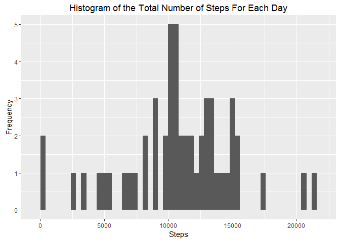
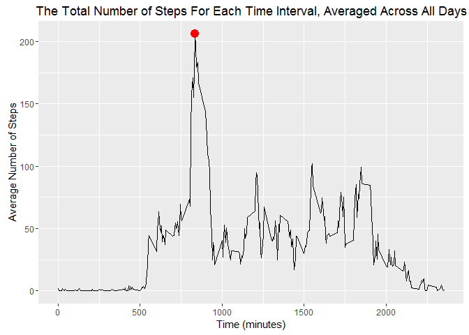
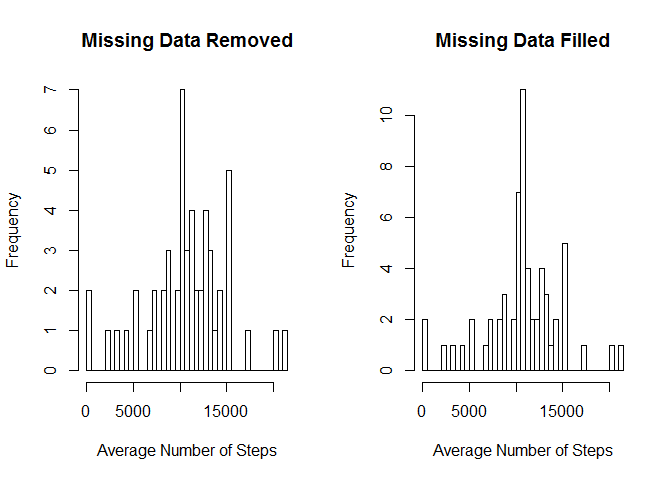
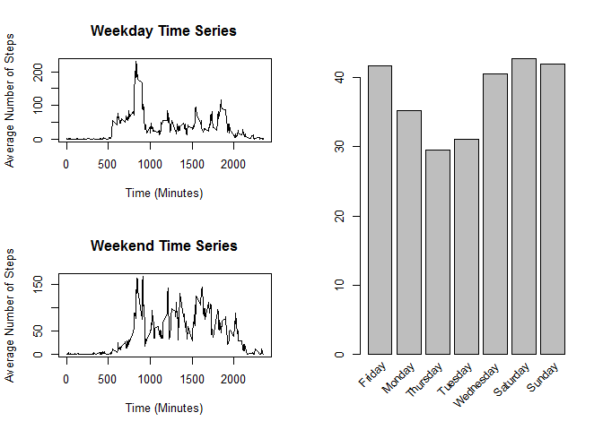

# Reproducible Research: Peer Assessment 1

This work can be found at github/sylvest00.


**Note**: To begin, the neccessary libraries were loaded and <span style="color:green">echo</span> was set to <span style="color:green">TRUE</span> (globally) so that the reviewer can read the code in this document. To set <span style="color:green">echo = TRUE</span>,


```r
library(knitr)
library(ggplot2)
library(dplyr)
opts_chunk$set(echo = TRUE)
```
In addition, library warning messages were suppressed in this document via the following arguments in R Markdown:

`{r, message = FALSE, warning = FALSE}`


## Loading and preprocessing the data
The CSV file containing activity data from a single individual was unzipped and read using `read.csv`:

```r
fileName <- unzip(zipfile = 'activity.zip')
activityData <- read.csv(fileName, header = TRUE)
```

The dates were converted to the class `Date` using `as.Date`.

```r
activityData$date <- as.Date(activityData$date, format = "%Y-%m-%d")
```


## What is the mean total number of steps taken per day?
1. Calculate the total number of steps taken per day
2. Make a histogram of the total number of steps
3. Calculate the mean and median of the total number of steps taken each day.
    
The total number of steps taken per day was calculated using `aggregate`. In the example below, missing values (<span style="color:red">NA</span>) were not removed from the data frame.

```r
# Compute the total number of steps per day,  with missing data
totalSteps <- aggregate(steps ~ date, data = activityData, 
                        FUN = sum, na.action = na.pass)

# Display the beginning of totalSteps
head(totalSteps)
```

```
##         date steps
## 1 2012-10-01    NA
## 2 2012-10-02   126
## 3 2012-10-03 11352
## 4 2012-10-04 12116
## 5 2012-10-05 13294
## 6 2012-10-06 15420
```
For the subsequent calculations, missing values were removed via the argument `na.action`.

```r
# Compute the total number of steps per day,  without missing data
totalSteps <- aggregate(steps ~ date, data = activityData, FUN = sum,
                        na.action = na.omit)

# Display the beginning of totalSteps
head(totalSteps)
```

```
##         date steps
## 1 2012-10-02   126
## 2 2012-10-03 11352
## 3 2012-10-04 12116
## 4 2012-10-05 13294
## 5 2012-10-06 15420
## 6 2012-10-07 11015
```

Next, a histogram of the total number of steps taken each day was created. The number of bins in the histogram was set to the total number of days within the data frame.

```r
ggplot(totalSteps,aes(steps)) + geom_histogram(bins = length(totalSteps$date)) +
    xlab("Steps") + ylab("Frequency") +
    ggtitle("Histogram of the Total Number of Steps For Each Day")
```

 

The `mean` and `median` of the total number of steps per day were computed from `totalSteps`:

```r
meanSteps <- mean(totalSteps$steps)
medianSteps <- median(totalSteps$steps)
```
The `mean` was 1.0766189\times 10^{4} and the `median` was 10765.


## What is the average daily activity pattern?

To construct a time series plot of the average number of steps taken for each interval, `aggregate` was used and missing values were removed.

```r
averageIntSteps <- aggregate(steps ~ interval, activityData, mean, na.rm = TRUE)

colnames(averageIntSteps) <- c("Interval", "AverageSteps")

maxStepIntIdx <- which(averageIntSteps$AverageSteps == max(averageIntSteps$AverageSteps))
maxStepInt <- averageIntSteps$Interval[maxStepIntIdx]
maxStep <- averageIntSteps$AverageSteps[maxStepIntIdx]

ggplot(averageIntSteps, aes(x = Interval, y = AverageSteps)) +
    geom_line() +
    geom_point(aes(x = maxStepInt, y = maxStep), colour = "red", size = 4) +
    xlab("Time (minutes)") + 
    ylab("Average Number of Steps") +
    ggtitle("The Total Number of Steps For Each Time Interval, Averaged Across All Days")
```

 

As shown in the graph above (the <span style="color:red">dot</span>), the interval beginning at minute 835 had the greatest number of steps, on average, with 206.17 steps.


## Imputing missing values
As seen in an earlier section of this report, the data file contains a number of missing values (coded as <span style="color:red">NA</span>). The presence of missing data may introduce bias into some calculations. To assess this problem, I first computed the number of missing values in the data set:

```r
numMissingValues <- length(which(is.na(activityData$steps)))
```
There is a total of 2304 missing values in the data set. This constitutes 13% of the data. The missing entries total either `0` or `288` for each day. This means that missing entries coincide with days in which data was not collected:


```r
dateArray <- unique(activityData$date)
missingCount <- array(data = 0, dim = length(dateArray))
for (i in 1:length(dateArray)){
    idx <- which(activityData$date == dateArray[i])
    missingCount[i] <- length(which(is.na(activityData$steps[idx])))
}
```

To address this issue, I substituted missing days with the mean number of steps for all intervals. To find the indicies of days with missing values, I found the index in which the total number of missing data points was equal to 288. I copied the original data set, `activityData`, to a new data frame, `newDF`, and changed all missing values to the average number of steps computed across each time interval:

```r
missingIdx <- which(missingCount == 288)
newDF <- activityData
missingDates <- dateArray[missingIdx]
for (i in 1:length(missingDates)){
    idx <- which(newDF$date == missingDates[i])
    newDF$steps[idx] <- averageIntSteps$AverageSteps
}
```


Next, the distribution of data between the two data sets were compared via a side-by-side comparison of their histograms.

```r
# Compute the total number of steps per day,  without missing data
totalSteps2 <- aggregate(steps ~ date, data = newDF, FUN = sum)

par(mfrow = c(1,2))
hist(totalSteps$steps, breaks = length(totalSteps$date), 
     main = 'Missing Data Removed', xlab = "Average Number of Steps")
hist(totalSteps2$steps, breaks = length(totalSteps2$date), 
     main = 'Missing Data Filled', xlab = "Average Number of Steps")
```

 

The distributions are very similar. For comparison, the mean and median of both data frames are below:

```r
summaryDF <- data.frame(x = c(mean(totalSteps2$steps),mean(totalSteps$steps, na.rm = TRUE)), y = c(median(totalSteps2$steps),median(totalSteps$steps, na.rm = TRUE)), row.names = c("Included","Excluded"))

colnames(summaryDF) <- c("Mean", "Median")
```
The medians are very similar and the means are equal for each data set:


|        |    Mean|  Median|
|:-------|-------:|-------:|
|Included|10766.19|10766.19|
|Excluded|10766.19|10765.00|


Filling in the missing data does not change the distribution of values. One must consider the implications of filling in the missing data using mean values since these could also introduce bias into the data set.


## Are there differences in activity patterns between weekdays and weekends?
First, I converted the date to the day of the week using the function `weekday` and stored that information in a new column of the data frame `newDF`. In another column, I changed the day of the week to either "wekend" or "weekday":

```r
newDF$weekday <- weekdays(newDF$date) 
idxWend <- grep("Saturday|Sunday",newDF$weekday)
idxW <- setdiff(1:length(newDF$weekday),idxWend)
newDF$weekday2 <- newDF$weekday
newDF$weekday2[idxW] <- "Weekday"
newDF$weekday2[idxWend] <- "Weekend"
```

To compare the activity levels of the individual across work days and weekend days, I produced a time series plot and a histogram of the average number of steps across all days of the week:

```r
wEndDF <- filter(newDF, weekday2 == "Weekend")
wEndDFAve <- aggregate(steps ~ weekday, wEndDF, mean)
wEndDFAveTS <- aggregate(steps ~ interval, wEndDF, mean)

wDF <- filter(newDF, weekday2 == "Weekday")
wDFAve <- aggregate(steps ~ weekday, wDF, mean)
wDFAveTS <- aggregate(steps ~ interval, wDF, mean)

summary2 <- rbind(wDFAve,wEndDFAve)

layout(matrix(c(1,3,2,3), 2, 2, byrow = TRUE))
plot(wDFAveTS$interval,wDFAveTS$steps, main = "Weekday Time Series", 
     type = "l", ylab = "Average Number of Steps", xlab = "Time (Minutes)")
plot(wEndDFAveTS$interval, wEndDFAveTS$steps, main = "Weekend Time Series", 
     type = "l", ylab = "Average Number of Steps", xlab = "Time (Minutes)")
bp <- barplot(summary2$steps, axes = FALSE, axisnames = FALSE)
text(bp, par("usr")[3], labels = summary2$weekday, 
     srt = 45, adj = c(1.1,1.1), xpd = TRUE, cex=.9)
axis(2)
```

 

The individual was the most active from Friday till Sunday.
